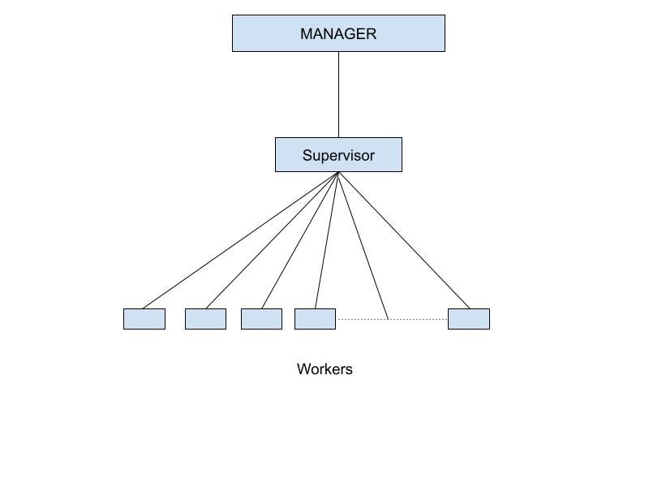

# Bitcoin Miner

The goal of this project is to create an distributed Bitcoin Miner using
Erlang and Actor Model.  
In real time every coin is mined using a Random String and Nonce. Nonce is a number which which is incremented and joined to the random string; each time a sha256 in run. We used similar uproach in this project.

## Contributors
Venkata Sai Dheeraj Naganaboina (vnaganaboina@ufl.edu)
Suraj Ramadugu (surajramadugu@ufl.edu)

## Architechture

This distributed mining approach contains 2 parts
1. Server
2. Client

#### Key Definitions
#### Workers:
Workers are the core processes which run sha256 and increment the nonce after each iteration and checks if the generated hash contain required number of leading zeros.
#### Supervisors:
Supervisors role is to create and manage all the workers and for each bitcoin a new supervisor is created.
#### Manager:
Takes input from the user; creates and manages all the supervisors.

### Server

Only one Manager is created in the server.
User passes input:
1. Number of leading zeroes required 
2. Number of bitcoins to mine(B)
Manager creates B number of supervisors.
Manager can receive any number of requests from the clients. (It can manage any number of clients)

B number of supervisors each creates a random string.
Each supervisor creates 10000 number of workers to mine bitcoins.
Supervisor also receives messages from workers and send messages to manager.

Workers create nonce and join it to the random string from supervisor.  
We followed STEP approach where each worker runs for 1000000 iterations and if it doesn't find the bitcoin it will increase Nonce to space which is not mined by any other bitcoin and starts mining again.     
Each worker runs's sha256 and checks for leading zeroes if found any returns it to supervisor.  
Once supervisor recives hash from worker; it will terminate all workers it has generated.   

### Client

Client Manager when started pings to server to connect.     
Server gives information of number of leading zeroes required to mine.      
Client Manager creates a supervisor which intern creates about 15000 workers and starts mining.
After each coin is mined client manager informs server on it.
Concurrently Client will start mining new coin.
Client only stops execution once server sends a terminate message.

## Execution Steps

#### Server execution steps
create server node
### `erl -name miningserver@ipV4-Address`

set cookies
### `erlang:set_cookie('anyCookieName')`

ping node to create erlang cluster
###  `net_kernel:connect_node('client@ipV4-Address')`

flush mailbox
###  `flush()`

compile server code
###  `c(miningserver)`

run
###  `miningserver:startServer(NumberOfLeadingZereos, NumberOfBitcoinsToMine)`

#### Client execution steps
update Server ipV4-Address info in the miningclient.erl bofore running
create client node
### `erl -name miningclient@ipV4-Address`

set cookies
### `erlang:set_cookie('anyCookieName')`

flush mailbox
###  `flush()`

compile server code
###  `c(miningclient)`

start client after starting Server
run
###  `miningclient:startclient()`

## Execution Details

1. We determined that creating 10000 workers to mine one bit coin is the optimal way as we are searching a large enough space, erlangVM is able to handle them easily and we are getting the best CPU utilization.

2. Mining 1 bitcoin with 4 leading zeroes
    

   Mining 100 bitcoins with 4 leading zeroes
    

   Mining 100 bitcoins with 4 leading zeroes
    

3. Average CPU time to Real time is around 15.

4. 8 bitcoins is  the maximum we were able to find.
   

5. We were able to connect 2 devices but code can support any number of clients to run as long as the number of coins to mine is big enough to give the clients enough time to connect as the server keeps mining the coins.

### Other Execution Details

1. Mining (1, 10) coins with 6 leading zeroes
   

2. Mining 1 coins with 7 leading zeroes 
   

## References
<a href="https://learnyousomeerlang.com/content" target="_blank">learn you some erlang</a>
